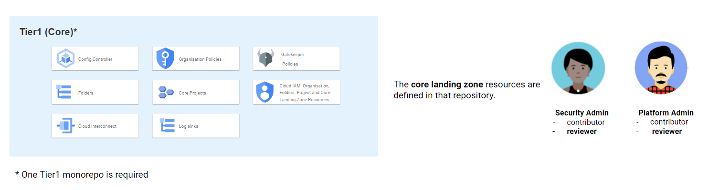
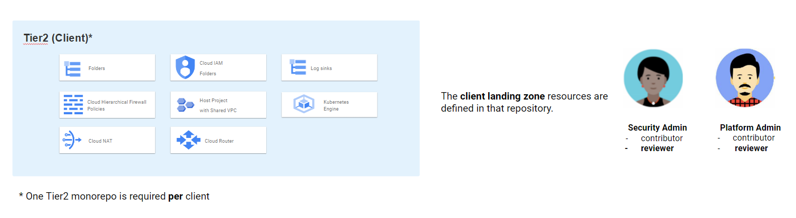
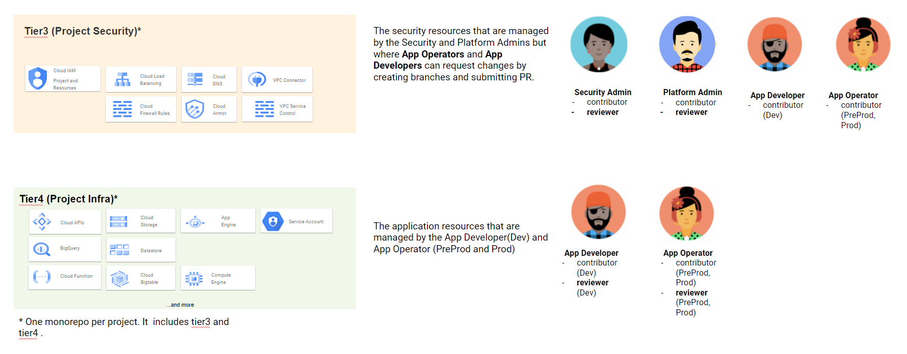
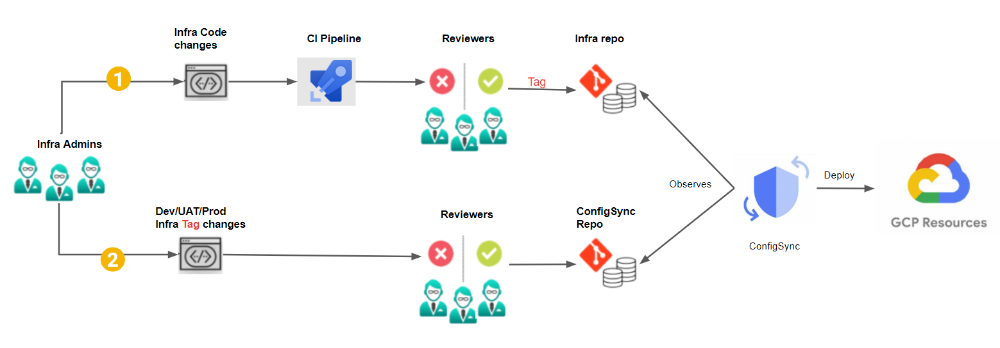
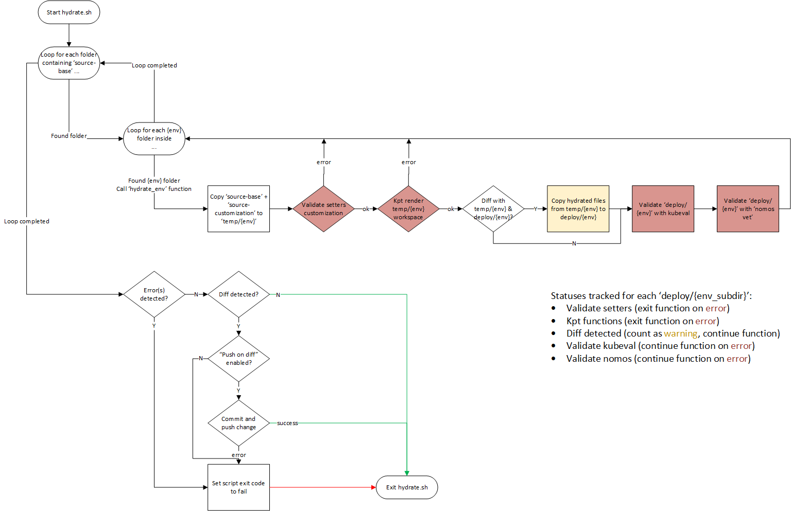

# Repository Structure

- [Structure du référentiel](#repository-structure)
  - [Définitions et rôles des dépôts](#repos-definitions-and-roles)
    - [Tier1](#tier1)
    - [Tier2](#tier2)
    - [Tier34](#tier34)
  - [Gitops](#gitops)
  - [Git](#git)
  - [Dépôts de déploiement](#deployment-repos)
    - [Git Submodule: `tools`](#git-submodule-tools)
    - [Hydration Process](#hydration-process)
  - [Gestion des versions](#versioning)

## Définitions et rôles des dépôts

SSC a adopté la structure [monorepo](https://monorepo.tools/) pour les référentiels. Les monorepos sont parfaits pour gérer plusieurs solutions dans un seul référentiel.

Les diagrammes ci-dessous montrent tous les **types** de référentiels et les **rôles** accordés aux équipes pour chacun d'eux.

### Tier1



### Tier2



### Tier34



## Gitops

La solution actuelle utilise [Config Sync](https://cloud.google.com/anthos-config-management/docs/config-sync-overview) avec les dépôts git pour extraire les configurations nécessaires au déploiement de l'infrastructure GCP.

Le diagramme ci-dessous décrit le processus Gitops.



Le processus pour implémenter un changement de code se déroule comme suit :

1. Le contributeur créera une branche et apportera des modifications de code dans un dossier tierX du monorepo et ouvrira une pull request.
2. Le processus CI valide le changement.
3. Les évaluateurs peuvent approuver ou refuser le PR.
4. Une fois la demande d'extraction terminée, la branche est fusionnée dans la branche principale et une nouvelle balise git spécifiant une nouvelle version est créée pour le dossier tierX concerné.
5. Le contributeur créera une branche et modifiera la valeur de la balise dans le dossier csync/source-customization/`env`/tierX en la définissant sur la nouvelle version créée à l'étape 4.
6. Le processus CI valide le changement.
7. Les évaluateurs peuvent approuver ou refuser le PR.
8. Une fois la pull request terminée, la branche est fusionnée dans la branche principale **mais** cette fois, **aucune** nouvelle balise n'est créée.
9. L'opérateur ConfigSync exécuté dans Config Controller qui observe déjà « HEAD » pour le dossier csync récupérera la nouvelle validation.
10. Il commencera à observer cette nouvelle version du dossier tierX.
11. Il déploie les ressources en conséquence dans GCP.
 &nbsp;

## Git

Les dépôts git sont organisés en différentes catégories :

- `gcp-blueprints-catalog` **dépôt privé** contient des packages spécifiques à SSC qui sont utilisés pour créer une zone d'atterrissage.
- `gcp-documentation` (ce dépôt) contient la documentation pour la zone d'atterrissage.
- `gcp-tools` contient des scripts courants et des modèles de pipeline utilisés comme sous-module git par les dépôts de déploiement ci-dessous.

- Déploiement monorepos :
  - `gcp-experimentation-tier1` contient toutes les ressources d'expérimentation.
  - `gcp-env-tier1` contient les ressources de base pour le développement, la préprod et la production.
  - `gcp-<client-name>-tier2` contient les ressources au niveau client pour dev, preprod et prod.
  - `gcp-<x-project-id>-tier34` contient les ressources de sécurité et d'application pour le développement, la préprod et la prod.
                                Vous devez remplacer le code d'environnement de l'ID du projet par le caractère "x" car ce dépôt contiendra la configuration de tous les environnements. Cela s'applique uniquement au nom du dépôt. N'utilisez pas x comme code d'environnement pour votre identifiant de projet dans `setters.yaml` car cela déclencherait une erreur de validation Gatekeeper : `le webhook d'admission "validation.gatekeeper.sh" a refusé la demande` !!!**

## Deployment Repos

Ces monorepos ont une structure de répertoires commune avec de légères variations.

Vous trouverez ci-dessous une brève explication des principaux composants du dépôt. Certains répertoires incluent des sous-répertoires pour chaque environnement qu'ils configurent (experimentation, dev, preprod, prod). Pour plus de simplicité, ils seront exprimés ci-dessous par `<env_subdirs>`.

```text
repo-root/
├── .azure-pipelines or .github : pipelines YAML files.
├── bootstrap/: (only in the "tier1" repos)
│   ├── <env_subdirs>/: contains `.env` file needed to create the management project which includes the Config Controller GKE cluster.
                        It also include the initial root-sync.yaml file that has been generated by the setup-kcc.sh script.
├── csync/
│   ├── deploy/: ("WET" folder) its content is automatically generated and must not be edited manually.
│   │   ├── <env_subdirs>/: contains the hydrated YAML files to be deployed.  **This is the directory observed by Config Sync.**
│   ├── source-base/: ("DRY" folder) contains a root-sync package that will be deployed to all environments.
│   ├── source-customization/
│   │   ├── <env_subdirs>/: contains the customization files that will overwrite the base for the environment.  Directory and file names must be replicated.
│                           To customize `source-base/root-sync-git/setters.yaml`, it should be copied, then edited, in `source-customization/<env_subdir>/root-sync-git/setters.yaml`.
├── tierX/
│   ├── deploy/: ("WET" folder) its content is automatically generated and must not be edited manually.
│   │   ├── <env_subdirs>/: contains the hydrated YAML files to be deployed.  **This is the directory observed by Config Sync.**
│   ├── source-base/: ("DRY" folder) contains a collection of *unedited* packages that will be deployed to all environments.
│   ├── source-customization/
│   │   ├── <env_subdirs>/: contains the customization files that will overwrite the base for the environment.  Directory and file names must be replicated.
│                           For example, to customize `source-base/core-landing-zone/setters.yaml`, it should be copied,
│                           then edited, in `source-customization/<env_subdir>/core-landing-zone/setters.yaml`.
├── tools/: git submodule from [gcp-tools](https://github.com/ssc-spc-ccoe-cei/gcp-tools)
├── modupdate.sh: script to checkout the git submodules, i.e. tools.
├── modversions.yaml: file used by modupdate.sh to specify which versions of git sub modules to checkout.
├── version-tagging-config.json
```

Voici les liens vers les modèles de référentiels pour chaque dépôt de déploiement :

- [gcp-tier1-template](https://github.com/ssc-spc-ccoe-cei/gcp-tier1-template)
- [gcp-tier2-template](https://github.com/ssc-spc-ccoe-cei/gcp-tier2-template)
- [gcp-tier34-template](https://github.com/ssc-spc-ccoe-cei/gcp-tier34-template)

### Git Submodule: `tools`

Comme mentionné ci-dessus, le dépôt [gcp-tools](https://github.com/ssc-spc-ccoe-cei/gcp-tools) est configuré en tant que sous-module git dans `.gitmodules`. Cette configuration git se limite à spécifier une branche.

Pour surmonter cette limitation et extraire une balise spécifique ou valider SHA, exécutez `modupdate.sh` pour extraire la version configurée dans `modversions.yaml`.

### Processus d'hydration

Le sous-module tools contient un script `hydrate.sh` pour hydrater les configurations avec `kpt`. Le script doit être exécuté lorsque des modifications sont apportées à « source-base » et/ou « source-customization ». Il peut être exécuté localement ou dans un hook de pré-commit et également dans un pipeline de validation lors de la création du PR.

À un niveau élevé, le script :

1. Recherchez les répertoires 'deploy', 'source-base' et 'source-customization' correctement structurés, puis pour chaque environnement (expérimentation, dev, preprod, prod), vérifiez si `source-customization/` contient ce sous-répertoire. Le cas échéant:
    - Créez un répertoire `temp-workspace/<env>` pour copier le `source-base/` puis copiez `source-customization/<env>/`, cela ajoute une personnalisation spécifique à cet environnement.
    - Vérifiez que les fichiers setters sont personnalisés.
    - Exécutez `kpt fn render` et supprimez les configurations locales dans `temp-workspace/<env>`.
    - Vérifiez si les fichiers nouvellement hydratés dans `temp-workspace/<env>` sont différents de `deploy/<env>`. Si tel est le cas, copiez-les dans `deploy/<env>`.
    - Validez les fichiers rendus dans `deploy/<env>` avec `kubeval` et `nomos vet`.
2. Si aucune erreur n'est trouvée et que des modifications sont détectées, vous pouvez éventuellement pousser vers la branche ou quitter le script avec un échec.
Un échec garantit un comportement correct lors de l’exécution à partir d’un hook de pré-validation ou d’un pipeline.



## Gestion des versions

Il est recommandé d'épingler une référence de dépôt et de dossier à un commit spécifique à l'aide de balises ou de commit SHA.

Un pipeline de balisage de version peut être utilisé pour incrémenter la version d'un dossier avec des balises git. Des exemples peuvent être trouvés dans le dépôt [gcp-tools](https://github.com/ssc-spc-ccoe-cei/gcp-tools/tree/main/pipeline-samples/version-tagging).

Alternativement, le commit SHA peut être utilisé. Bien qu’il ne soit pas aussi intuitif que les balises, il est considéré comme plus sécurisé.
