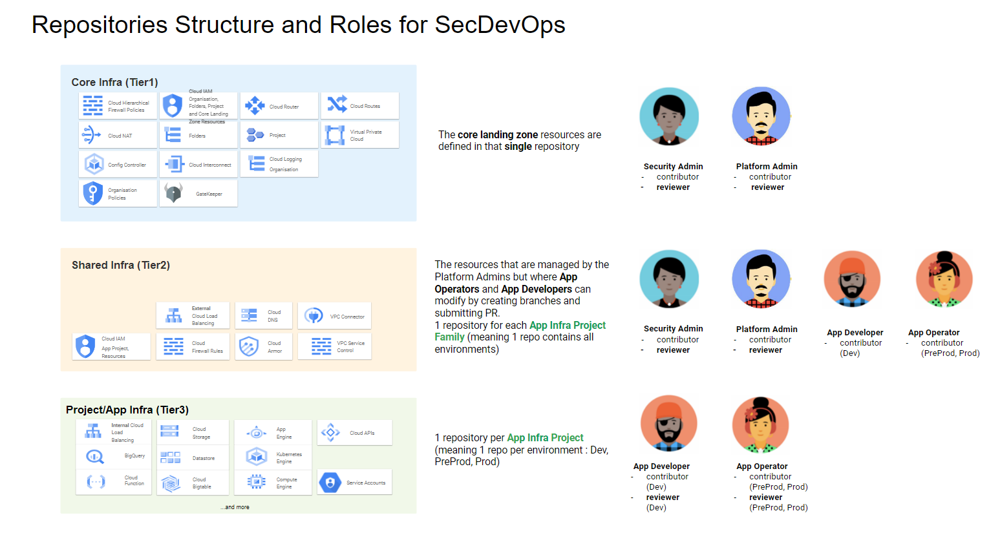
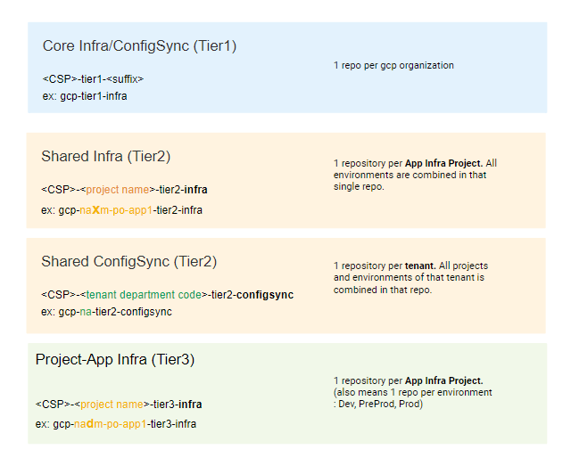
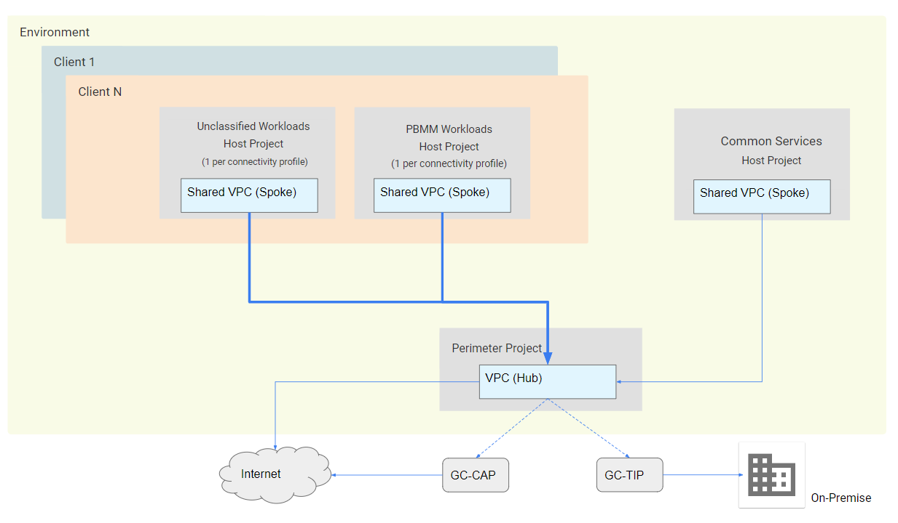

# Developer's guide

## Background Information

Shared Services Canada offers the GCP landing zone as-a-service. This landing zone follows ITSG-33 security requirements while implementing GCP best practices. This service can be leveraged by any Government of Canada departments or agencies to host their applications.

## Purpose

This guide will provide the necessary information that any Application Developer or Application Operator needs to successfully host a workload in the SSC landing zone and streamline it's ATO process.

## Technology Overview

SSC chose [Anthos Config Management](https://cloud.google.com/anthos/config-management) to manage the Infrastructure-as-code. ACM uses Kubernetes config connector manifest to control resources deployed in GCP. Most developers have some level of experience with Kubernetes manifest file format and should not feel lost when looking, for the first time, at a Kubernetes [config connector](https://cloud.google.com/config-connector/docs/reference/overview) resource definition.

### The Anthos Config Management components are:

### 1. Config Sync

Manifest files are stored, and version controlled in a git repository.

A Kubernetes operator running on the ACM Kubernetes cluster called "Config Sync" observe that git repository and reconcile all manifests following a GitOps process.

The Git deployment process looks like this

### 2. Policy Controller

Example of policy use cases

### 3. Config Controller

# Shared Services Canada - GCP Landing zone

SSC has built 4 distinct GCP organizations to isolate each environment from each other. The environments are experimentation, DEV, UAT and PROD.
TODO: update diagram to reflect experimentation

## Experimentation / Sandbox

  This environment provides a great level of flexibility and autonomy to application developers. The objective is really to allow you to experiment any GCP services without requiring the implication of the platform administrator.

  It meets [TBS Cloud Usage Profile 1](https://canada-ca.github.io/cloud-guardrails/EN/00_Applicable-Scope.html) requirements and only allows **Unclassified** workloads.
  
  ### Cost

  This project is linked to a GCP billing account owned by **"your organization"**.
  
  ### Permissions

  Your team gets granted `Editor` role on the GCP project.
  
  ### Working with GCP

  Interaction with GCP is possible through the [cloud console](https://console.cloud.google.com/) or using [Gcloud SDK](https://cloud.google.com/sdk/docs/) from [Cloud Shell](https://cloud.google.com/shell/docs/) or any other Linux or windows computer, you can also interact with the GCP API directly. To do so, you authenticate with your Google Cloud Identity `user` account.

  ### Networking

  You project comes with an existing networking configuration. This configuration meets the 30 days [Guardrails](https://github.com/canada-ca/cloud-guardrails-gcp) requirements for experimentation (Guardrails 1,2,4,8,12). The `Editor` role grants you permissions to create, for example, firewall rule.

  Below is the list of networking resources that have been deployed in your experimentation project:
  - VPC (flow logs enabled)
  - Subnets (Montreal and Toronto regions)
      - PAZ
      - APPRZ
      - DATARZ
  - Route to the internet (resources requires a `network tag`)
  - Cloud NAT
  - DNS logging policy

  

## DEV, UAT and PROD (UNDER CONSTRUCTION)

The DEV environment is where you will be developing your application. UAT and PROD should be used for code promotion with your choice of CD pipeline.

As you may expect, the number of security controls implemented for DEV, UAT and PROD is much larger than for the experimentation environment. The 12 `30 days guardrails` and numerous additional ITSG 33 controls are enforced within these environments so that you can streamline the ATO process of your applications by leveraging the ATO of the SSC GCP landing zone.

### Cost

Your projects are linked to a GCP billing account owned by **"your organization"**.

### Permissions

Your team (developers) gets granted `Viewer` role on the GCP project in the Dev organization only. To enforce separation of duties, it is the application operator that is granted that same role for the UAT and PROD organization.

### Working with GCP

As a developer/operator, you will be granted access to git repositories. Those repo are observed by ACM - ConfigSync ([see above](#1-config-sync)) so that the existing Kubernetes manifest will be automatically applied by ACM. The GCP resources (GCE, GCS, etc.) you require for your application needs to be defined as manifest file following the config connector [schema](https://cloud.google.com/config-connector/docs/reference/overview).

The landing zone uses 3 different tiers of git repositories to manage GCP resources. The diagram below demonstrates what resource type is defined in each tier as well as what roles and permissions is configured for each one of them.

### Tier 2

As you saw in that diagram, the resources for your application are include in two tiers called "tier 2" and "tier 3". Tier 2 is where this landing zone differs from other traditional services by trying to simplify as much as possible the management of the application security while maintaining a very strong and secure control on the environment. You get one tier 2 repository for each tier 3 repository (one-to-one relationship). As an app developer/operator, you do have full control (contributor + reviewer) over your tier 3 repository, but you also have contributor role on the tier 2 repo thus implementing that simplified change management process. It is the Platform Admin and the Security Admin that will be reviewing and approving the PR.

So, when you want a change implemented on your tier 2 repo, you have two options:
1. create a branch on the tier 2 repo, make and commit your changes and then, open a pull request
2. reach out to platform admin and determine a solution

Once that change is merged into the main branch, a new tag on the repo gets created. That tag is a version number following the [standard](https://semver.org/) major.minor.patch. TODO: update with tagging process requirements (changelog, etc.)

ConfigSync is not configured to observe the main branch, instead, it is configured to watch a specific tag on the `Infra` repo. If you want to get your new version in effect for DEV, UAT or PROD, you need to change that tag inside the `ConfigSync` repo.

That full process is illustrated in this diagram

TODO: provide an example

### Repositories naming convention

The diagram below describes the naming convention for repositories and uses na, as a client, to provide examples.

### Networking

Below is the networking High level Design.
TODO: provide more details once network design is finalized

## Training
- GCP
    - Google Cloud Platform Fundamentals
    - Developing Applications with Google Cloud

- CCCS
    - Cloud Computing in the GC: The SA&A Process

## GCP Landing Zone Resource Addendum

[Resources Addendum](../Architecture/Addendum.md)