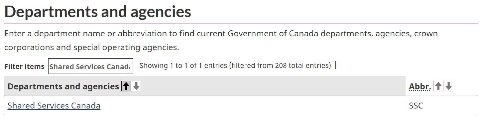
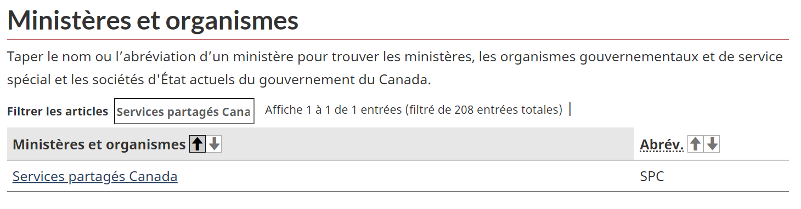
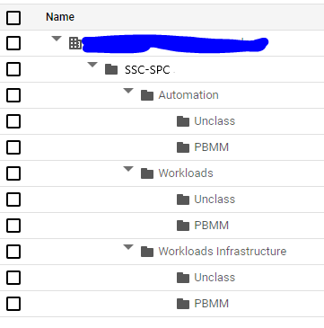

# Client Onboarding

- [Client Onboarding](#client-onboarding)
  - [Required Information](#required-information)
    - [Essential Contacts](#essential-contacts)
  - [1. Create `tier2` monorepo](#1-create-tier2-monorepo)
  - [2. Build the Client Landing Zone](#2-build-the-client-landing-zone)
    - [Package Details](#package-details)
  - [3. Perform the post-deployment steps](#3-perform-the-post-deployment-steps)
  - [THE END](#the-end)

--------------------------------------

## Required Information

1. Client's Name. It will be used for many resources including the client's root folder.

    > When creating the client folder, it's display name must adhere to a bilingual nomenclature and leverage the official abbreviation list of current Government of Canada departments,
    > agencies, Crown Corporations and special operating agencies: [https://www.canada.ca/en/government/dept.html](https://www.canada.ca/en/government/dept.html).
    >
    > For example, when creating a client folder to represent Shared Services Canada, employ both the official English and French abbreviation separated by a dash (e.g. ssc-spc).
    >
    > 
    >
    > 
    >
    > In order to uphold folder name requirements in the Google Cloud Console ([Creating and managing folders](https://cloud.google.com/resource-manager/docs/creating-managing-folders#:~:text=For%20example%2C%20to%20create%20folders,%2C%20spaces%2C%20hyphens%20and%20underscores)), avoid using accented characters in French.

1. User or Group that should be granted Folder Viewer role on the client's folder structure. The screenshot below provides an example of the folder structure that this entity will view in GCP.

    

### Essential Contacts

> **!!! FUTURE RELEASE !!!**

## 1. Create `tier2` monorepo

- For Experimentation, you do not require this step as all packages are deployed in a single monorepo `gcp-experimentation-tier1`.

- For Dev, PreProd and Prod, follow the "Create New Deployment Monorepo" section in [Repositories.md](./Repositories.md) to create one `gcp-<client-name>-tier2` monorepos.

## 2. Build the Client Landing Zone

You will build the client landing zone by adding packages to the `tier1` and `tier2` monorepos.

At a high level, the process below needs to be completed for each package :

1. Setup your change, follow step 1 of [Changing.md](./Changing.md#step-1---setup)
1. Add a Package, follow step 2A of [Changing.md](./Changing.md#a-add-a-package)
1. Generate hydrated files, follow step 3 of [Changing.md](./Changing.md#step-3---hydrate).
1. Publish changes to repository, follow step 4 of [Changing.md](./Changing.md#step-4---publish).
1. Once the PR is merged, note the new tag version or commit SHA.  It will be required in the next section.
1. Synchronize and promote configuration, follow step 5 of [Changing.md](./Changing.md#step-5---synchronize--promote-configs).

### Package Details

> **!!! It's important that all of the steps listed above are completed for each package before proceeding with the next package. !!!**

1. The client-setup package
    - For Experimentation, you do not require this package.

    - For Dev, PreProd and Prod, you deploy this [package](https://github.com/GoogleCloudPlatform/pubsec-declarative-toolkit/tree/main/solutions/client-setup) inside the `gcp-env-tier1` repo.

      - Package details:

          ```shell
          export TIER='tier1'

          export REPO_URI='https://github.com/GoogleCloudPlatform/pubsec-declarative-toolkit.git'

          export PKG_PATH='solutions/client-setup'

          # the version to get, located in the package's CHANGELOG.md, use 'main' if not available'
          export VERSION=''

          # replace <client-name> value
          export LOCAL_DEST_DIRECTORY='clients/<client-name>/client-setup'
          ```

      - Customization:

          ```shell
          # replace <client-name> with the client-name value
          export FILE_TO_CUSTOMIZE='clients/<client-name>/client-setup/setters.yaml'
          ```

1. The client landing zone package:

    - For Experimentation, you deploy this [package](https://github.com/GoogleCloudPlatform/pubsec-declarative-toolkit/tree/main/solutions/experimentation/client-landing-zone) inside the `gcp-experimentation-tier1` repo.

      - Package details:

        ```shell
        export TIER='tier1'

        export REPO_URI='https://github.com/GoogleCloudPlatform/pubsec-declarative-toolkit.git'

        export PKG_PATH='solutions/experimentation/client-landing-zone'

        # the version to get, located in the package's CHANGELOG.md, use 'main' if not available'
        export VERSION=''

        export LOCAL_DEST_DIRECTORY='clients/<client-name>/client-landing-zone'
        ```

      - Customization:

          ```shell
          export FILE_TO_CUSTOMIZE='clients/<client-name>/client-landing-zone/setters.yaml'
          ```

    - For Dev, PreProd and Prod, you deploy this [package](https://github.com/GoogleCloudPlatform/pubsec-declarative-toolkit/tree/main/solutions/client-landing-zone) inside the `gcp-<client-name>-tier2` repo.

      - Package details:

        ```shell
        export TIER='tier2'

        export REPO_URI='https://github.com/GoogleCloudPlatform/pubsec-declarative-toolkit.git'

        export PKG_PATH='solutions/client-landing-zone'

        # the version to get, located in the package's CHANGELOG.md, use 'main' if not available'
        export VERSION=''

        export LOCAL_DEST_DIRECTORY='client-landing-zone'
        ```

      - Customization:

          ```shell
          export FILE_TO_CUSTOMIZE='client-landing-zone/setters.yaml'
          ```

## 3. Perform the post-deployment steps

Some resources from the `client-setup` package won't be able to deploy until the new `<client-name>-projects-sa` is granted `billing.user` role.

Perform step 5 from this [procedure](https://github.com/GoogleCloudPlatform/pubsec-declarative-toolkit/blob/main/docs/landing-zone-v2/README.md#5-perform-the-post-deployment-steps) to fix this.

## THE END

Congratulations! You have completed the deployment of your client landing zone as per SSC implementation.
