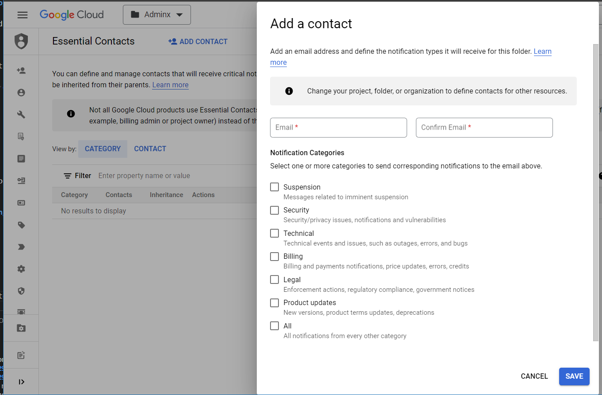

# Client Onboarding

<!-- vscode-markdown-toc -->
* [Required Information](#RequiredInformation)
	* [TODO: Future enhancement](#TODO:Futureenhancement)
* [1. Create `tier2` monorepo](#Createtier2monorepo)
* [2. Build the Client Landing Zone](#BuildtheClientLandingZone)
	* [Package Details](#PackageDetails)
* [3. Perform the post-deployment steps](#Performthepost-deploymentsteps)
* [THE END](#THEEND)

<!-- vscode-markdown-toc-config
	numbering=false
	autoSave=true
	/vscode-markdown-toc-config -->
<!-- /vscode-markdown-toc -->

## <a name='RequiredInformation'></a>Required Information

1. Client's Name
1. When creating the name of a client folder, it must adhere to a bilingual nomenclature and leverage the official abbreviation list of current Government of Canada departments, agencies, Crown Corporations and special operating agencies: [https://www.canada.ca/en/government/dept.html](https://www.canada.ca/en/government/dept.html).

   For example, when creating a client folder to represent Shared Services Canada, employ both the official English and French abbreviation separated by a dash (e.g. ssc-spc).

   

   

   In order to uphold folder name requirements in the Google Cloud Console ([Creating and managing folders](https://cloud.google.com/resource-manager/docs/creating-managing-folders#:~:text=For%20example%2C%20to%20create%20folders,%2C%20spaces%2C%20hyphens%20and%20underscores)), avoid using accented characters in French.

    

1. User or Group that should be granted Folder Viewer role on the client's folder structure

    

### <a name='TODO:Futureenhancement'></a>TODO: Future enhancement

1. User or Group that should be granted `Essential Contacts` Admin role on the client's folder structure

    

1. User or Group that should be granted `Essential Contacts` Viewer role on the client's folder structure

## <a name='Createtier2monorepo'></a>1. Create `tier2` monorepo

Follow the "Create New Deployment Monorepo" section in [Repositories.md](./Repositories.md) to create one `tier2` monorepos.

The name of the repo has to follow this convention: `gcp-<client-name>-tier2`

## <a name='BuildtheClientLandingZone'></a>2. Build the Client Landing Zone

We will build the client landing zone by adding packages to the `tier1` and `tier2` monorepos.

At a high level, the process below needs to be completed for each package :

1. Setup your change, follow step 1 of [Changing.md](./Changing.md#step-1---setup)
1. Add a Package, follow step 2A of [Changing.md](./Changing.md#a-add-a-package)
1. Generate hydrated files, follow step 3 of [Changing.md](./Changing.md#step-3---hydrate).
1. Publish changes to repository, follow step 4 of [Changing.md](./Changing.md#step-4---publish).
1. Once the PR is merged, note the new tag version or commit SHA.  It will be required in the next section.
1. Synchronize and promote configuration, follow step 5 of [Changing.md](./Changing.md#step-5---synchronize--promote-configs).

### <a name='PackageDetails'></a>Package Details

> **!!! It's important that all of the steps listed above are completed for each package before proceeding with the next package. !!!**

1. The client-setup package:
    - Repository: `gcp-env-tier1`

      Package details:

        ```shell
        export TIER='tier1'

        export REPO_URI='https://github.com/GoogleCloudPlatform/pubsec-declarative-toolkit.git'

        export PKG_PATH='solutions/client-setup'

        # the version to get, located in the package's CHANGELOG.md, use 'main' if not available'
        export VERSION=''

        # replace <client-name> value
        export LOCAL_DEST_DIRECTORY='clients/<client-name>/client-setup'
        ```

    - Customization:

        ```shell
        # replace <client-name> with the client-name value
        export FILE_TO_CUSTOMIZE='clients/<client-name>/client-setup/setters.yaml'
        ```

1. The client landing zone package:
    - Repository: `gcp-<client-name>-tier2`

      Package details:

      ```shell
      export TIER='tier2'

      export REPO_URI='https://github.com/GoogleCloudPlatform/pubsec-declarative-toolkit.git'

      export PKG_PATH='solutions/client-landing-zone'

      # the version to get, located in the package's CHANGELOG.md, use 'main' if not available
      export VERSION=''

      export LOCAL_DEST_DIRECTORY='client-landing-zone'
      ```

    - Customization:

        ```shell
        export FILE_TO_CUSTOMIZE='client-landing-zone/setters.yaml'
        ```

## <a name='Performthepost-deploymentsteps'></a>3. Perform the post-deployment steps

Some resources from the `client-setup` package won't be able to deploy until the new `<client-name>-projects-sa` is granted `billing.user` role.

Perform step 5 from this [procedure](https://github.com/GoogleCloudPlatform/pubsec-declarative-toolkit/blob/main/solutions/landing-zone-v2/README.md#5-perform-the-post-deployment-steps) to fix this.

## <a name='THEEND'></a>THE END

Congratulations! You have completed the deployment of your client landing zone as per SSC implementation.
