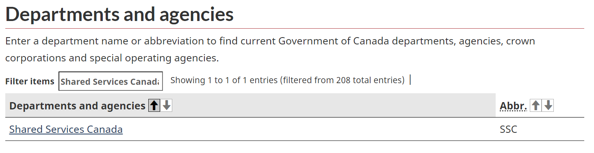
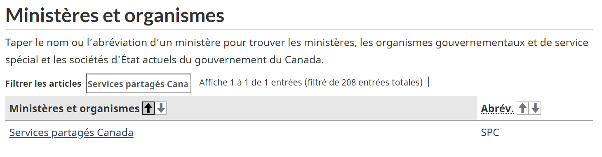

# Intégration des clients

- [Intégration du client](#client-onboarding)
  - [Informations requises](#required-information)
    - [Contacts essentiels](#essential-contacts)
  - [1. Créer un monorepo `tier2`](#1-create-tier2-monorepo)
  - [2. Construire la zone d'accueil client](#2-build-the-client-landing-zone)
    - [Détails du forfait](#package-details)
  - [3. Effectuer les étapes post-déploiement](#3-perform-the-post-deployment-steps)
  - [LA FIN](#the-end)
  - [Étape suivante](#next-step)

--------------------------------------

## Information requise

1. Nom du client. Il sera utilisé pour de nombreuses ressources dont le dossier racine du client.

    > Lors de la création du dossier client, son nom d'affichage doit respecter une nomenclature bilingue et tirer parti de la liste officielle des abréviations des ministères actuels du gouvernement du Canada,
    > agences, sociétés d'État et organismes de service spécial : [https://www.canada.ca/fr/gouvernement/dept.html](https://www.canada.ca/fr/gouvernement/dept.html).
    >
    > Par exemple, lors de la création d'un dossier client pour représenter Services partagés Canada, utilisez les abréviations officielles en anglais et en français séparées par un tiret (par exemple, ssc-spc).
    >
    > 
    >
    > 
    >
    > Afin de respecter les exigences en matière de nom de dossier dans Google Cloud Console ([Création et gestion de dossiers](https://cloud.google.com/resource-manager/docs/creating-managing-folders#:~:text=For% 20exemple%2C%20à%20créer%20dossiers,%2C%20espaces%2C%20traits d'union%20et%20traits de soulignement)), évitez d'utiliser des caractères accentués en français.

1. Utilisateur ou groupe qui doit se voir attribuer le rôle d'observateur de dossiers sur la structure de dossiers du client. La capture d'écran ci-dessous fournit un exemple de la structure des dossiers que cette entité affichera dans GCP.

    

### Contacts essentiels

> **!!! FUTURE SORTIE !!!**

## 1. Créer un monorepo `tier2`

- Pour l'expérimentation, vous n'avez pas besoin de cette étape car tous les packages sont déployés dans un seul monorepo `gcp-experimentation-tier1`.

- Pour Dev, PreProd et Prod, suivez la section "Créer un nouveau monorepo de déploiement" dans [Repositories.md](../Landing%20Zone%20Operations/Repositories.md) pour créer un `gcp-<client-name>-tier2 `monorepos.

## 2. Créez la zone d'accueil client

Vous construirez la zone d'atterrissage client en ajoutant des packages aux monorepos « tier1 » et « tier2 ».

À un niveau élevé, le processus ci-dessous doit être complété pour chaque package :

1. Configurez votre modification, suivez l'étape 1 de [Changing.md](./Changing.md#step-1---setup)
1. Ajoutez un package, suivez l'étape 2A de [Changing.md](./Changing.md#a-add-a-package)
1. Générez des fichiers hydratés, suivez l'étape 3 de [Changing.md](./Changing.md#step-3---hydrate).
1. Publiez les modifications dans le référentiel, suivez l'étape 4 de [Changing.md](./Changing.md#step-4---publish).
1. Une fois le PR fusionné, notez la nouvelle version de la balise ou validez SHA. Cela sera nécessaire dans la section suivante.
1. Synchronisez et promouvez la configuration, suivez l'étape 5 de [Changing.md](./Changing.md#step-5---synchronize--promote-configs).

### Détails du paquet

> **!!! Il est important que toutes les étapes répertoriées ci-dessus soient effectuées pour chaque package avant de passer au package suivant. !!!**

1. Le package de configuration client
    - Pour l'expérimentation, vous n'avez pas besoin de ce package.

    - Pour Dev, PreProd et Prod, vous déployez ce [package](https://github.com/GoogleCloudPlatform/pubsec-declarative-toolkit/tree/main/solutions/client-setup) dans le `gcp-env-tier1` dépôt.

      - Détails du package (lors de l'exécution de [étape 2A](../Landing%20Zone%20Operations/Changing.md#a-add-a-package)) :

          ```shell
          export TIER='tier1'

          export REPO_URI='https://github.com/GoogleCloudPlatform/pubsec-declarative-toolkit.git'

          export PKG_PATH='solutions/client-setup'

          # the version to get, located in the package's CHANGELOG.md, use 'main' if not available'
          export VERSION=''

          # replace <client-name> value
          export LOCAL_DEST_DIRECTORY='clients/<client-name>'
          ```

      - Personnalisation:

          ```shell
          # replace <client-name> with the client-name value
          export FILE_TO_CUSTOMIZE='clients/<client-name>/client-setup/setters.yaml'
          ```

1. Le package de zone d'accueil client :

    - Pour l'expérimentation, vous déployez ce [package](https://github.com/GoogleCloudPlatform/pubsec-declarative-toolkit/tree/main/solutions/experimentation/client-landing-zone) à l'intérieur du `gcp-experimentation-tier1` dépôt.

      - Détails du package (lors de l'exécution de [étape 2A](../Landing%20Zone%20Operations/Changing.md#a-add-a-package)) :

        ```shell
        export TIER='tier1'

        export REPO_URI='https://github.com/GoogleCloudPlatform/pubsec-declarative-toolkit.git'

        export PKG_PATH='solutions/experimentation/client-landing-zone'

        # the version to get, located in the package's CHANGELOG.md, use 'main' if not available'
        export VERSION=''

        export LOCAL_DEST_DIRECTORY='clients/<client-name>'
        ```

      - Personnalisation:

          ```shell
          export FILE_TO_CUSTOMIZE='clients/<client-name>/client-landing-zone/setters.yaml'
          ```

    - Pour Dev, PreProd et Prod, vous déployez ce [package](https://github.com/GoogleCloudPlatform/pubsec-declarative-toolkit/tree/main/solutions/client-landing-zone) dans le fichier `gcp-<client- nom>-tier2` dépôt.

      - Détails du package (lors de l'exécution de [étape 2A](../Landing%20Zone%20Operations/Changing.md#a-add-a-package)):

        ```shell
        export TIER='tier2'

        export REPO_URI='https://github.com/GoogleCloudPlatform/pubsec-declarative-toolkit.git'

        export PKG_PATH='solutions/client-landing-zone'

        # the version to get, located in the package's CHANGELOG.md, use 'main' if not available'
        export VERSION=''

        export LOCAL_DEST_DIRECTORY=''
        ```

      - Personnalisation:

          ```shell
          export FILE_TO_CUSTOMIZE='client-landing-zone/setters.yaml'
          ```

## 3. Effectuez les étapes post-déploiement

Certaines ressources du package `client-setup` ne pourront pas être déployées tant que le nouveau `<client-name>-projects-sa` n'aura pas obtenu le rôle `billing.user`.

Effectuez l'étape 5 de cette [procédure](https://github.com/GoogleCloudPlatform/pubsec-declarative-toolkit/blob/main/docs/landing-zone-v2/README.md#5-perform-the-post-deployment -étapes) pour résoudre ce problème.

## LA FIN

Toutes nos félicitations! Vous avez terminé le déploiement de votre zone d'atterrissage client conformément à la mise en œuvre de SSC.

## L'étape suivante

Exécutez la [procédure] d’intégration de l’application (./Application.md).
