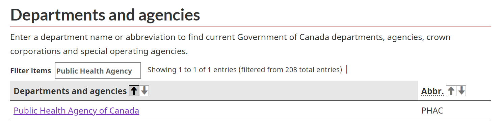
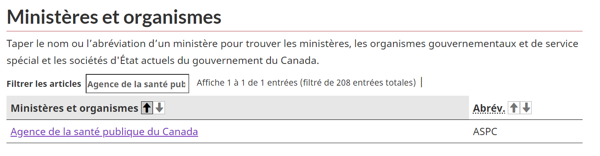
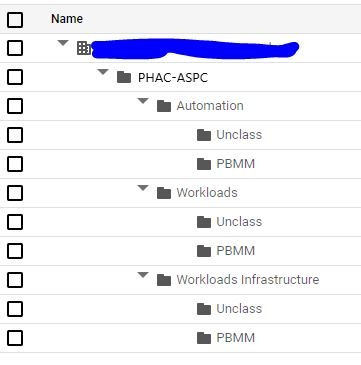

# Tenant Onboarding

## Required Information

1. Tenant's Name
1. When creating the name of a tenant folder, it must adhere to a bilingual nomenclature and leverage the official abbreviation list of current Government of Canada departments, agencies, Crown Corporations and special operating agencies: [https://www.canada.ca/en/government/dept.html](https://www.canada.ca/en/government/dept.html).

   For example, when creating a tenant folder to represent the Public Health Agency of Canada, employ both the official English and French abbreviation separated by a dash (e.g. PHAC-ASPC).

   

   
    
   In order to uphold folder name requirements in the Google Cloud Console ([Creating and managing folders](https://cloud.google.com/resource-manager/docs/creating-managing-folders#:~:text=For%20example%2C%20to%20create%20folders,%2C%20spaces%2C%20hyphens%20and%20underscores)), avoid using accented characters in French.

    

1. User or Group that should be granted Folder Viewer role on the tenant's folder structure

    


### TODO: Future enhancement
1. User or Group that should be granted `Essential Contacts` Admin role on the tenant's folder structure

    

1. User or Group that should be granted `Essential Contacts` Viewer role on the tenant's folder structure

## Pre-requisite

1. locally clone the landing zone repo for this environment
1. create a branch from main


## Add tenant folder(s) to the landing zone repository

1. Move into source-base folder
    ```
    cd source-base
    ```
1. Get the hierarchy/tenant package
    - Sandbox
      ```
      kpt pkg get https://github.com/GoogleCloudPlatform/pubsec-declarative-toolkit.git/solutions/hierarchy/tenant-sandbox@main ./landing-zone/hierarchy/Tenants/<tenant name>
      ```

    - DEV, UAT, PROD
      ```
      kpt pkg get https://github.com/GoogleCloudPlatform/pubsec-declarative-toolkit.git/solutions/hierarchy/tenant-env@main ./landing-zone/hierarchy/Tenants/<tenant name>
      ```

1. To modify any of the files in these packages (like setters.yaml) follow this generic guidance
  
    Refer to the `Make Code Changes` section of the [Changing.md](../Landing%20Zone%20Operations/Changing.md#Make%20code%20changes)

1. Generate hydrated files

    Refer to the `Generate hydrated files` section of the [Changing.md](../Landing%20Zone%20Operations/Changing.md#Generate%20hydrated%20files)

1. Add changes to repository
    
    Refer to the `Add changes to repository` section of the [Changing.md](../Landing%20Zone%20Operations/Changing.md#Add%20changes%20to%20repository)


## Add tenant Tier2-ConfigSync (DEV, UAT, PROD only) (UNDER CONSTRUCTION)

TODO: complete this steps

